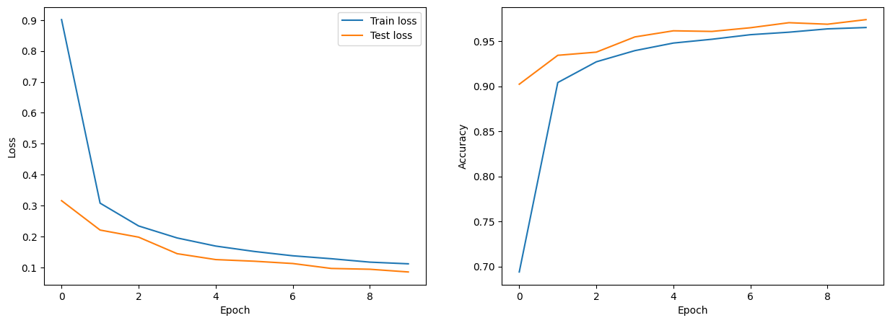
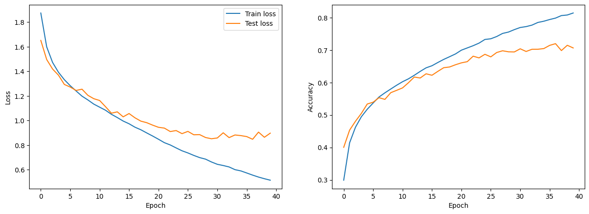
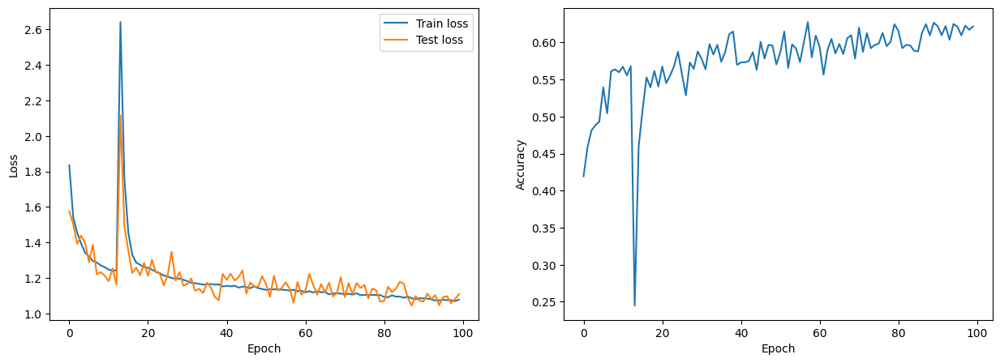

# Deep Learning Essentials
CNN 101 on MNIST : 

Vision Transformer on MNIST: 

*VIT MNIST - Train & Test => Loss and Accuracy 10 epochs.*

Vision Transformer (Mark 2) on CIFAR10: 

*VIT CIFAR10 - FIRST TRAINING : Train loss, test loss and accuracy of the model during training.*

Vision Transformer on CIFAR10 : 

*VIT CIFAR10 - FIRST TRAINING : Train loss, test loss and accuracy of the model during training.*

